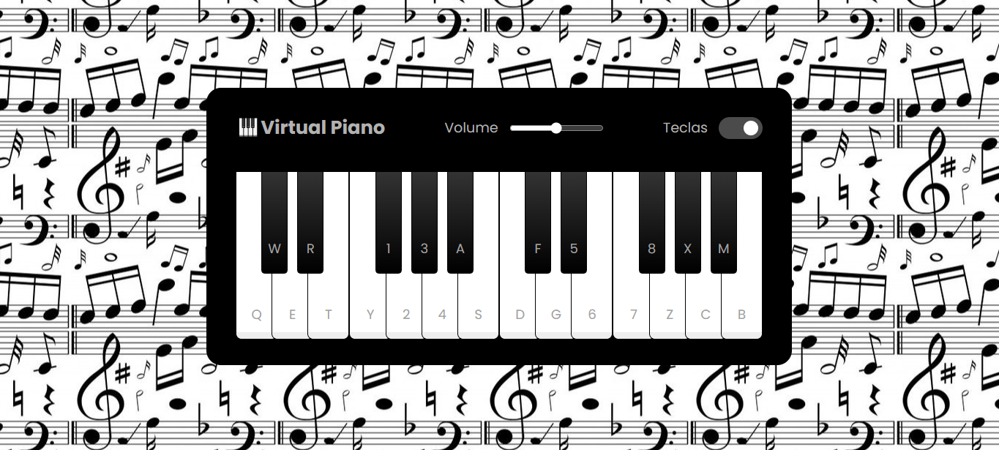

## 🎮 Projeto Jogo Piano 🎹
Desafio de projeto proposto pelo expert Felipe Aguiar da plataforma da DIO (Digital Innovation One).  
O objetivo desse projeto é criar um jogo simulando um piano utilizando HTML, CSS e JavaScript.

## 💻 Tecnologias usadas:

  
  
  

## 🖥 Preview do Jogo:

  

- Venha jogar acessando [aqui nesse link do GithubPages]()

## ⚙ Execução do Jogo
1. **Clonar Repósitório:** basta utilizar o comando `git clone` para clonar esse projeto e salvar na máquina e depois executar o arquivo `index.html`.
2. **GitHubPages:** pode também acessar o projeto nesse [link](), que abrirá esse projeto no GitHubPages, sem precisar baixar o repositório na sua máquina.

## 🕹 Como jogar
- O objetivo é tocar no piano digitando os carecteres mostrados na teclas do piano ou clicando usando o mouse em cada tecla.
- Ao ser clicado é reproduzido um som da nota musicak.
- Ainda você pode controlar o volume do piano ou esconder os carecteres mostrados no piano.

## 🤔 O que foi feito de diferente nesse jogo:
- Utilizado Favicon;
- Colocado mais teclas e sons no piano;
- Foi organizado as teclas do piano de forma correta, respeitando os tons  e semitons;
- Utilizei um background de notas musicais.

## 📌 Créditos
- **Favicon:** Disponível no site [Flaticon](https://www.flaticon.com/br/icones-gratis/);
- **Audio:** Disponível no repositório do [Manual Dev](https://github.com/manualdodev/piano);
- **Background notas musicais:** Disponível no site do [Pinterest](https://br.pinterest.com/pin/583145851771818051/)
